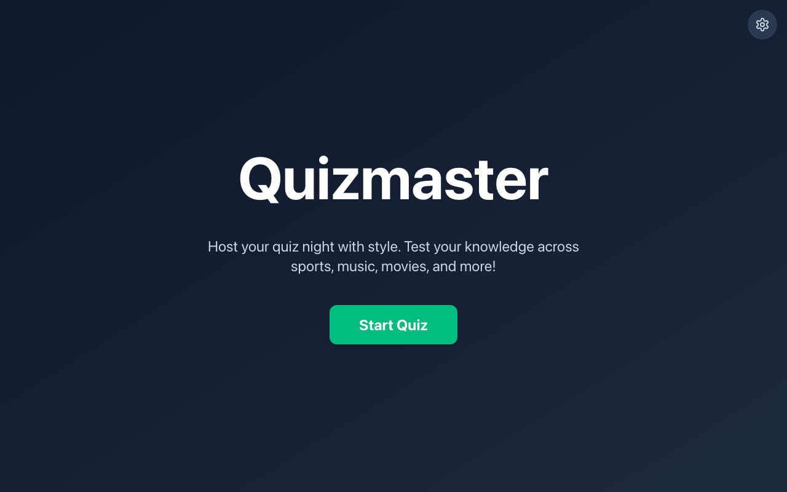
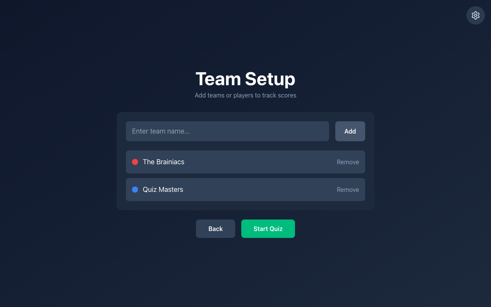
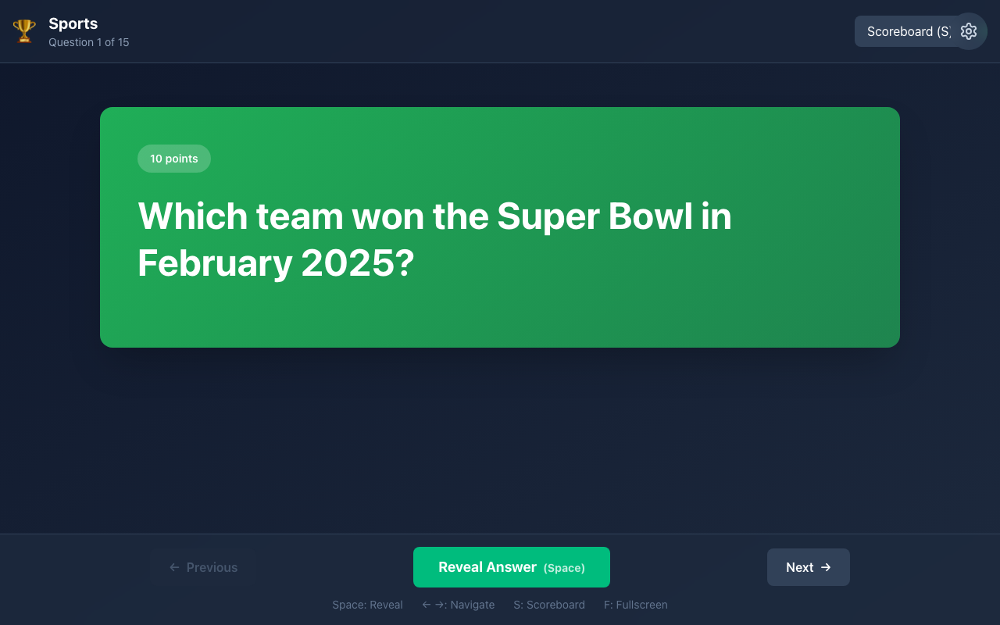
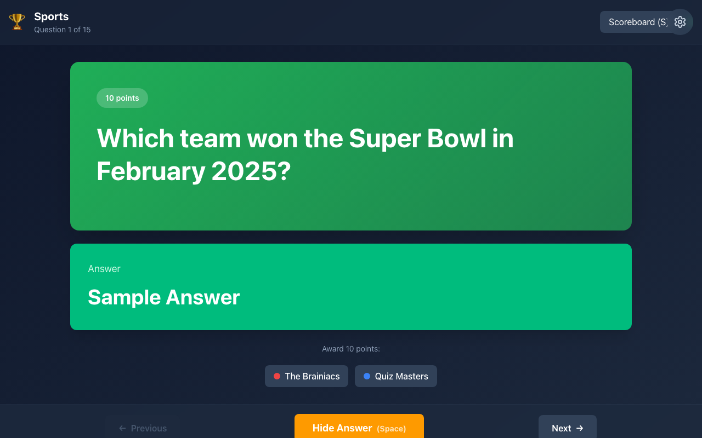
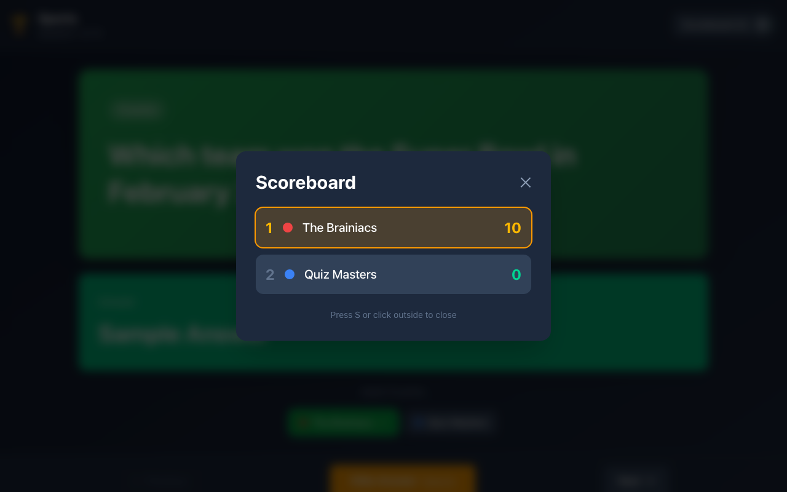
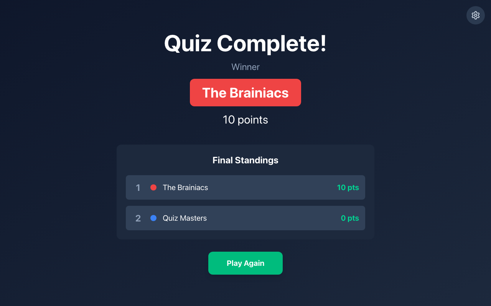

# Quizmaster

A presentation-style quiz web application for hosting pub quiz nights and trivia events. Display questions on a shared screen and control the quiz flow with keyboard shortcuts or on-screen controls.

## Features

- **Multiple Question Sets** - Choose from different themed quizzes (Christmas, Football, etc.)
- **Presentation Mode** - Host controls the quiz, showing questions one at a time
- **Category Intros** - Section intro pages introduce each category before questions begin
- **Multiple Categories** - Each question set contains themed categories with questions
- **Team Scoring** - Track scores for multiple teams with a live scoreboard
- **Keyboard Shortcuts** - Space (reveal answer), arrows (navigate), S (scoreboard), F (fullscreen)
- **Answer Animations** - Smooth reveal animations for dramatic effect
- **Responsive Design** - Large typography optimized for group viewing

## Screenshots

| Home | Team Setup |
|------|------------|
|  |  |

| Quiz Question | Answer Revealed |
|---------------|-----------------|
|  |  |

| Scoreboard | Results |
|------------|---------|
|  |  |

## Getting Started

```bash
# Install dependencies
pnpm install

# Start development server
pnpm dev

# Build for production (includes TypeScript check)
pnpm build

# Run linter
pnpm lint

# Preview production build
pnpm preview
```

## Usage

1. **Home** - Select a question set and click "Start Quiz"
2. **Setup** - Add team names (e.g., "Team A", "The Brainiacs")
3. **Quiz** - Navigate through category intros and questions, reveal answers with controls
4. **Results** - View final standings when the quiz ends

### Keyboard Shortcuts

| Key | Action |
|-----|--------|
| Space | Reveal/Hide answer |
| → | Next question |
| ← | Previous question |
| S | Toggle scoreboard |
| F | Toggle fullscreen |

## Testing

```bash
# Run Playwright tests
pnpm test

# Run tests with interactive UI
pnpm test:ui
```

## Adding Questions

Questions are organized into **Question Sets**, each containing multiple categories. To add a new question set:

1. Create a new file in `src/data/questions/sets/` (e.g., `my-quiz.ts`)
2. Register it in `src/data/questions/registry.ts`

### Question Set Structure

```typescript
import { QuestionSet } from '../../../types'

export const myQuiz: QuestionSet = {
  id: 'my-quiz',
  name: 'My Quiz',
  description: 'A custom quiz description',
  icon: '🎯',
  categories: [
    {
      id: 'category-1',
      name: 'Category Name',
      description: 'Category description shown on intro page',
      icon: '🎬',
      color: '#22c55e',
      questionCount: 5,
      questions: [
        {
          id: 'q1',
          categoryId: 'category-1',
          questionNumber: 1,
          type: 'text',  // or 'multiple-choice' or 'picture'
          questionText: 'Your question here?',
          answer: 'The answer',
          acceptableAnswers: ['Alternative answer'],  // optional
          points: 10,
        },
      ],
    },
  ],
}
```

## Tech Stack

- React 18 + TypeScript
- Vite
- Tailwind CSS
- Framer Motion
- Playwright (testing)
